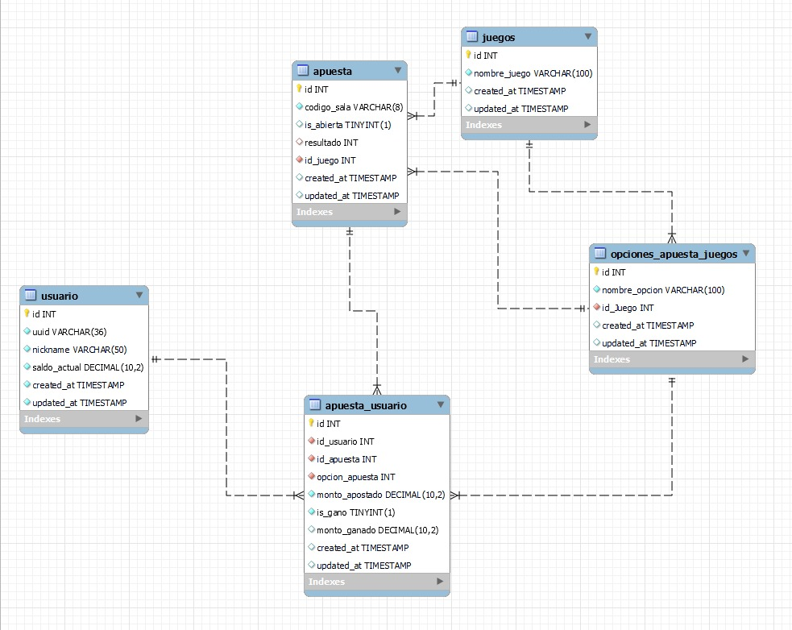

# Proyecto final Modelos de programación II
# Simulador de Gambling


Este proyecto es el Backend del trabajo final de la materia "Modelos de Programación 2". Proporciona la lógica de negocio y la gestión de datos para la aplicación de gambling en línea.

Está desarrollado con FastAPI y utiliza SQLAlchemy para la gestión de la base de datos. El backend maneja la creación y consulta de usuarios, apuestas y salas de juego. Además, incorpora Prolog para la validación de reglas de apuestas y la determinación de resultados.

El sistema cuenta con autenticación de usuarios, validaciones de apuestas y manejo eficiente de transacciones para garantizar la integridad de los datos.

## Participantes
- Luis Miguel Viuche Madroñero (20212020082)
- Daniel Alejandro Chavez Bustos (20212020109)
- Dilan Stive Arboleda Zambrano (20212020105)


# Let's Go Gambling\~! - Backend

Este es el backend de **Let's Go Gambling\~!**, una aplicación de gambling desarrollada con FastAPI y SQLAlchemy para la gestión de usuarios, apuestas y salas de juego.

## Tecnologías Utilizadas

- **Python**
- **FastAPI** - Framework para construir APIs rápidas y eficientes.
- **SQLAlchemy** - ORM para manejar la base de datos.
- **SQLite** (por defecto) - Base de datos utilizada.
- **Pydantic** - Para validación de datos en modelos.

## Estructura del Proyecto

```
backend/
│-- main.py
│-- config/
│   ├── db.py
│-- models/
│   ├── global_models.py
│-- routers/
│   ├── usuario.py
│-- schemas/
│   ├── admin.py
│   ├── usuario.py
└-- README.md
```

### Descripción de los archivos

- **`main.py`**: Punto de entrada de la aplicación.
- **`config/db.py`**: Configuración de la base de datos con SQLAlchemy.
- **`models/global_models.py`**: Definición de los modelos de la base de datos.
- **`routers/usuario.py`**: Rutas para gestionar usuarios, apuestas y salas.
- **`schemas/admin.py`**: Modelos Pydantic para la creación y cierre de salas.
- **`schemas/usuario.py`**: Modelos Pydantic para validación de usuarios y apuestas.





## Instalación y Configuración

1. Clonar el repositorio:

   ```sh
   git clone https://github.com/tu-usuario/lets-go-gambling.git
   cd lets-go-gambling/backend
   ```

2. Crear y activar un entorno virtual:

   ```sh
   python -m venv venv
   source venv/bin/activate  # En Windows: venv\Scripts\activate
   ```

3. Instalar dependencias:

   ```sh
   pip install -r requirements.txt
   ```

4. Ejecutar el servidor FastAPI:

   ```sh
   uvicorn main:app --reload
   ```

## Endpoints Principales

### Usuarios

- **`GET /usuarios`** - Obtiene todos los usuarios registrados.
- **`POST /usuario`** - Crea un usuario nuevo.
- **`GET /usuario/{uuid}`** - Consulta la información y el historial de apuestas de un usuario por UUID.

### Salas

- **`GET /sala/{codigo_sala}`** - Obtiene información de una sala por su código.
- **`POST /sala/apostar`** - Permite a un usuario ingresar a una sala y realizar una apuesta.

## Modelos de Datos

### `schemas/usuario.py`

#### **UsuarioBaseModel**

```python
class UsuarioBaseModel(BaseModel):
    nickname: str
```

#### **ApuestaUsuarioBaseModel**

```python
class ApuestaUsuarioBaseModel(BaseModel):
    uuid_usuario: str
    codigo_sala: str
    opcion_apuesta: int
    monto_apuesta: float
```

### `schemas/admin.py`

#### **CrearSalaBaseModel**

```python
class CrearSalaBaseModel(BaseModel):
    id_juego: int
```

#### **CerrarSalaBaseModel**

```python
class CerrarSalaBaseModel(BaseModel):
    codigo_sala: str
```

## Consideraciones Adicionales

- Se utiliza manejo de excepciones para evitar errores en la base de datos y proporcionar respuestas claras a los clientes.
- Las apuestas requieren un monto mínimo de 200 y no pueden superar el saldo del usuario.
- Un usuario no puede realizar más de una apuesta en la misma sala.

## Licencia

Este proyecto se encuentra bajo la licencia **MIT**. Puedes usarlo, modificarlo y distribuirlo libremente.

---

**Repositorio:** [GitHub - Let's Go Gambling\~!](https://github.com/tu-usuario/lets-go-gambling)

